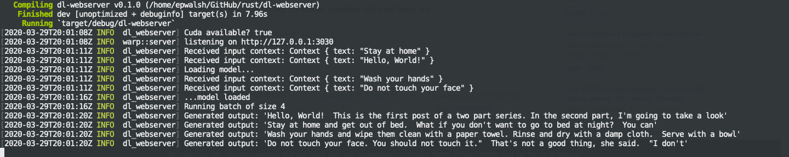

# rust-dl-webserver

This project provides an example of serving a deep learning model with batched prediction using Rust.
In particular it runs a GPT2 model from [rust-bert](https://github.com/guillaume-be/rust-bert) to generate text based on input context.

## Features

- Batched prediction using [`batched-fn`](https://github.com/epwalsh/batched-fn) when GPU is detected.
- Back pressure mechanism that will return a 503 status code if the server gets back-logged with too many requests.

## Running the server

In order for the server to make use of your GPU (if you have one available) you'll need to compile it against the right
version of the LibTorch C++ library, which you can download from
[https://pytorch.org/get-started/locally/](https://pytorch.org/get-started/locally/).

After downloading, unzip the file and then run the server with

```bash
make run LIBTORCH=/path/to/libtorch
```

If you don't have a GPU available, just run

```bash
make run
```

Now in a separate terminal you can send several requests in to the server at once:

```bash
curl -d '{"text":"Hello, World!"}' \
    -H "Content-Type: application/json" \
    http://localhost:3030/generate &
curl -d '{"text":"Stay at home"}' \
    -H "Content-Type: application/json" \
    http://localhost:3030/generate &
curl -d '{"text":"Wash your hands"}' \
    -H "Content-Type: application/json" \
    http://localhost:3030/generate &
curl -d '{"text":"Do not touch your face"}' \
    -H "Content-Type: application/json" \
    http://localhost:3030/generate &
```

The logs from the server should look something like this:


